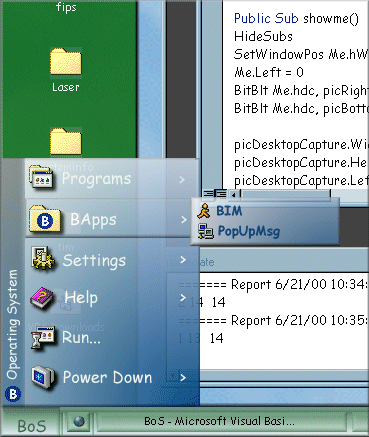



## BoS 1\.1 \- Skinnable, customizable desktop replacement \- now with AOL Instant Messaging

### Description

BoS is a complete desktop replacement. It replaces your desktop icons, taskbar, system tray, and start menu with customizable, translucent versions. BoS also has AOL Instant Messaging built in, and a lot more. BoS inculdes four skins: BoS Standard, Green Shades, Red Shades, and BMac. Additional skins can be downloaded with the integrated skin downloader! *** Note: BoS is for Windows 98 and Windows 2000 only. Be sure to put Alphablending.dll in your \windows\system directory. Alphablending.dll will not register with rcreg32 ***
 
### More Info
 

             |
---                |---
**Submitted On**   |2000-06-01 15:00:36
**By**             |[Brian](https://github.com/Planet-Source-Code/PSCIndex/blob/master/ByAuthor/brian.md)
**Level**          |Advanced
**User Rating**    |4.5 (72 globes from 16 users)
**Compatibility**  |VB 5\.0, VB 6\.0
**Category**       |[Complete Applications](https://github.com/Planet-Source-Code/PSCIndex/blob/master/ByCategory/complete-applications__1-27.md)
**World**          |[Visual Basic](https://github.com/Planet-Source-Code/PSCIndex/blob/master/ByWorld/visual-basic.md)
**Archive File**   |[CODE\_UPLOAD6322612000\.zip](https://github.com/Planet-Source-Code/brian-bos-1-1-skinnable-customizable-desktop-replacement-now-with-aol-instant-messaging__1-8541/archive/master.zip)

